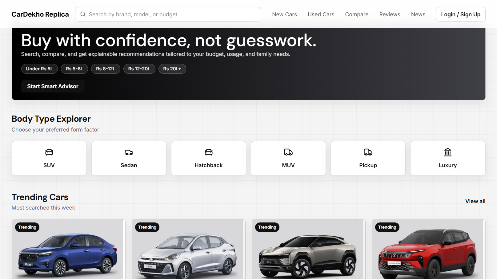
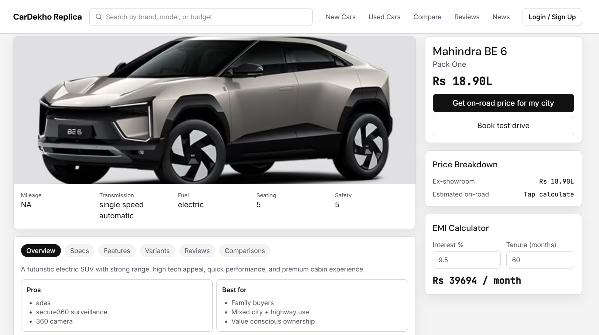
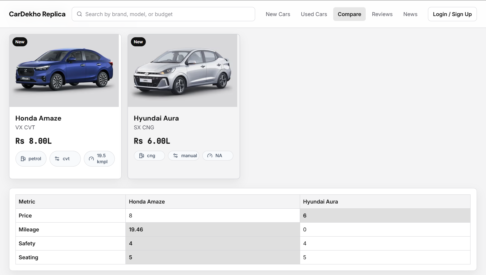

# CarDekho Replica

Frontend-only car discovery MVP. The app reads directly from `data/cars.json`; there is no backend, database, Docker, Nginx, GraphQL, Redis, Celery, or virtual environment required.

## Screenshots

### Home


### Car Detail


### Compare


## What Is Included

- Browse cars from `data/cars.json`
- Filter by body type, fuel, transmission, price, and search text
- Car detail pages
- Local recommendations
- Side-by-side comparison
- Login page placeholder
- Browser-local shortlist using `localStorage`

## Tech Stack

- React 18
- TypeScript
- Vite
- Tailwind CSS
- TanStack Query
- Zustand
- React Router
- Lucide React

## Run Locally

From the project root:

```powershell
npm i
npm run dev
```

Open:

```text
http://127.0.0.1:5173
```

You can also run from the frontend folder:

```powershell
cd frontend
npm i
npm run dev
```

## Build

```powershell
npm run build
```

## Data Source

All catalogue data lives in:

```text
data/cars.json
```

The frontend maps this file into the app's car-card, detail, compare, recommendation, and shortlist views. To add or edit cars, update `data/cars.json` and refresh the Vite app.

## Project Shape

```text
data/
  cars.json
frontend/
  src/
    data/catalog.ts
    pages/
    components/
    features/
```

This project is intentionally kept simple for the MVP. Any API, database, or deployment layer can be added later only when the app actually needs it.
